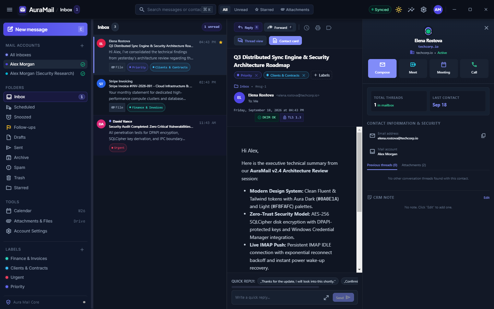
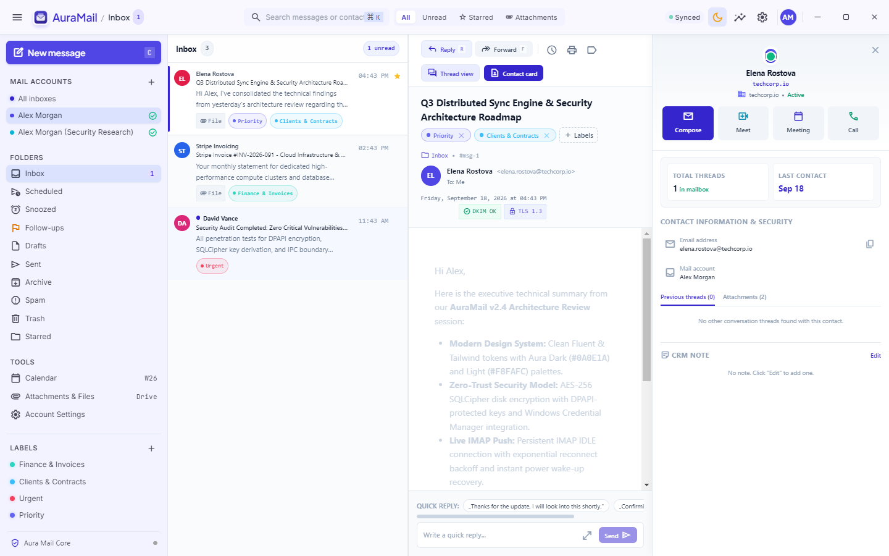
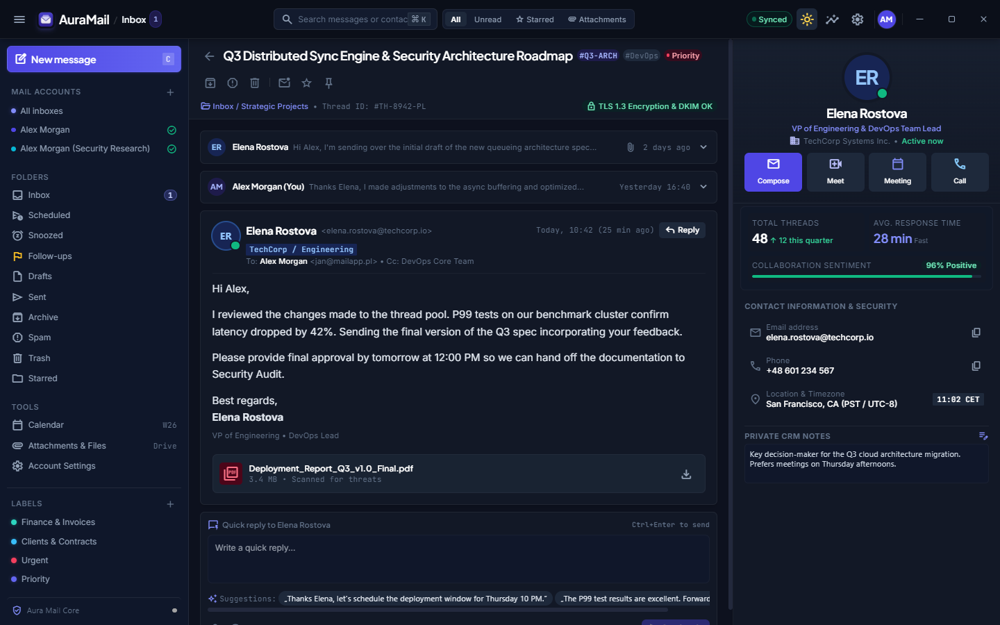
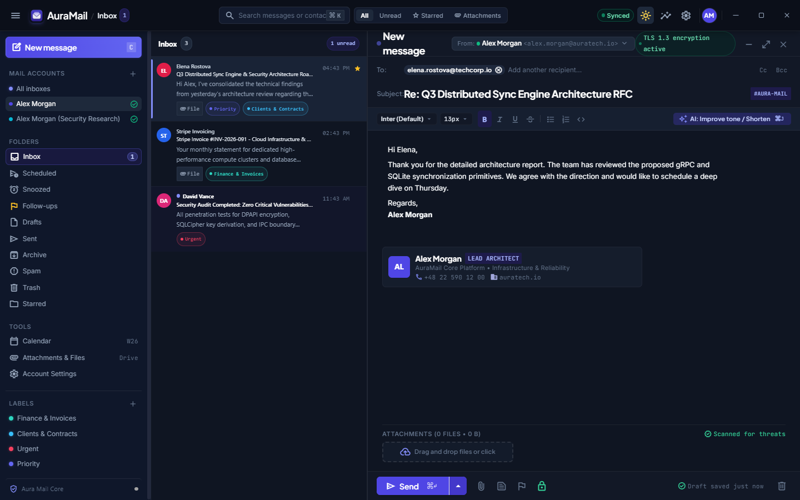
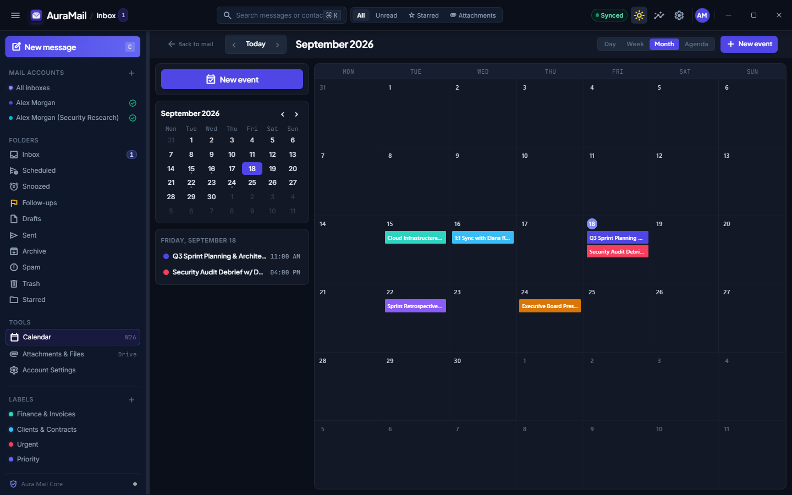

<div align="center">

# ⚡ AuraMail

**The modern, private, and high-performance native email client for Windows & Linux.**

Built with **Electron 33**, **React 18**, and **SQLCipher**. Engineered from the ground up for privacy, speed, and productivity.

[](https://github.com/qvbvs/auramail/releases)
[](https://github.com/qvbvs/auramail)
[](https://nodejs.org/)
[](./LICENSE)
[](./SECURITY.md)
[](https://react.dev/)

[Features](#-key-features) • [Screenshots](#-preview--interface) • [Architecture](#-architecture-overview) • [Tech Stack](#-technology-stack) • [Quick Start](#-quick-start) • [Linux Setup](#-linux-support--system-requirements) • [Security](#-security--privacy)

</div>

---

## 🖼️ Preview & Interface

<div align="center">

### Aura Dark & Aura Light Mode
<p align="center">
  
  
</p>

### Power Workflows
<p align="center">
  
  
  
</p>

</div>

---

## ✨ Key Features

### 🛡️ Enterprise-Grade Security & Privacy
- **Encrypted Local Database**: All messages, contacts, and metadata are stored in an encrypted SQLite database using **SQLCipher (AES-256)** (`better-sqlite3-multiple-ciphers`).
- **Hardware-Backed Key Protection**: Database encryption keys are generated randomly per installation and protected using **Electron safeStorage** (backed by **Windows DPAPI** on Windows and the **Secret Service API / GNOME Keyring / KWallet** on Linux). Stealing the `.db` file alone is completely useless.
- **Zero Secrets in SQLite**: Mail account passwords and authentication tokens are kept exclusively in the native OS Credential Manager via `keytar` (**Windows Credential Manager** on Windows, **libsecret** on Linux) — never written to SQLite or application logs.
- **Strict Process Hardening**: `contextIsolation: true`, `sandbox: true`, `nodeIntegration: false`, and a strict Content Security Policy (CSP). External links always open in your default system browser.

### ⚡ Real-Time Push & Offline-First Sync
- **Live IMAP IDLE Push**: Immediate incoming email notifications without aggressive or battery-draining polling loops.
- **Resilient Recovery**: Exponential backoff with jitter on reconnects, plus instant resumption when your computer wakes from sleep or screen unlock (`powerMonitor`).
- **Unified Multi-Account Inbox**: Manage multiple IMAP/SMTP accounts simultaneously with unified folders, per-account colors, and thread grouping.
- **Offline Full-Text Search (FTS5)**: Blazing-fast instant search across subjects, senders, and message bodies without requiring an active internet connection.

### ✍️ Intelligent Composition & Scheduling
- **Modern Tiptap Composer**: Rich text formatting, link embedding, code blocks, checklists, and inline attachment management.
- **Send Later & Snooze**: Schedule outbound messages for specific delivery windows or snooze emails until later, powered by a reliable background scheduler.
- **Automated Follow-Up Reminders**: Automatically alerts you when an important sent email hasn't received a reply within a designated time.
- **Automation Rules & Custom Labels**: Filter and categorize incoming messages automatically by sender, subject, or domain.

### 📅 Unified Workspace & Productivity
- **Integrated Calendar**: Native calendar supporting Day, Week, Month, and Agenda views with local event scheduling and meeting links.
- **Contact & Thread Dossier**: Deep contextual timeline cards displaying correspondence history, collaboration sentiment, average response times, and CRM notes.
- **Global Command Palette (`Ctrl+K` / `⌘K`)**: Seamless keyboard navigation across folders, accounts, search queries, and actions without touching the mouse.
- **System Tray Integration**: Minimizes cleanly to the Windows notification tray with quick actions and real-time unread badges.
- **Full Bilingual Support (PL / EN)**: Seamlessly toggle between English and Polish with automatic system locale detection.

---

## 🛠️ Technology Stack

| Layer | Technology | Description |
|---|---|---|
| **App Shell** | [Electron 33](https://www.electronjs.org/), `electron-vite`, `electron-builder` | High-performance desktop container targeting Windows (NSIS). |
| **Main Process** | [TypeScript 5](https://www.typescriptlang.org/), `imapflow`, `nodemailer`, `mailparser` | Robust Node.js runtime handling IMAP IDLE, SMTP, and background scheduler. |
| **Encrypted Storage** | `better-sqlite3-multiple-ciphers` (SQLCipher), SQLite FTS5 | AES-256 local encrypted storage with versioned, append-only migrations. |
| **Credential Security** | `keytar` + Electron `safeStorage` (Windows DPAPI) | Secure OS vault integration for account passwords and master encryption keys. |
| **Renderer UI** | [React 18](https://react.dev/), [Fluent UI](https://react.fluentui.dev/), [Tailwind CSS](https://tailwindcss.com/) | Fluid, accessible interface adhering to Fluent Design System standards. |
| **Rich Text Editor** | [Tiptap](https://tiptap.dev/) (`starter-kit`, `link`, `underline`) | Extensible headless prose editor for composing formatted messages. |
| **State Management** | [Zustand](https://zustand-demo.pmnd.rs/) | Minimalist, predictable state stores per domain (mail, accounts, calendar, scheduler). |
| **Validation** | [Zod](https://zod.dev/) | Strict runtime schema validation across the IPC process boundary. |
| **Testing** | [Vitest](https://vitest.dev/), [Playwright](https://playwright.dev/) | Comprehensive unit, integration, and end-to-end visual capture suites. |

---

## 🏛️ Architecture Overview

```
src/
├── main/              # Electron Main Process (Node.js)
│   ├── mail/          # IMAP client, IDLE manager, sync engine, rules, threading
│   ├── smtp/          # Outbound mail delivery via Nodemailer
│   ├── database/      # SQLCipher SQLite schema and versioned migrations
│   ├── security/      # safeStorage DB key & Windows Credential Manager (keytar)
│   ├── calendar/      # Local calendar events repository
│   ├── scheduler/     # Background queue for "Send Later", snooze, and follow-ups
│   ├── settings/      # Application preferences (key-value store in SQLite)
│   ├── tray/          # System tray icon and localized context menu
│   └── ipc/           # IPC handler registration with Zod runtime validation
├── preload/           # Secure context bridge (contextIsolation, no nodeIntegration)
├── renderer/          # React 18 User Interface
│   └── src/
│       ├── components/ # Sidebar, MessageList, Reader, ComposerPane, CalendarView, ...
│       ├── state/      # Zustand reactive stores (accounts, mail, calendar, labels)
│       ├── i18n/       # Bilingual localization dictionaries (PL / EN)
│       └── theme/      # Aura Dark and Light design tokens
└── shared/            # Type definitions and IPC channel contracts shared across processes
```

For complete technical specifications on the IPC contract, sync engine, and security invariants, see [ARCHITECTURE.md](./ARCHITECTURE.md).

---

## ⚡ Quick Start

### Prerequisites

- **Operating System**:
  - **Windows 10 or 11** (64-bit) with **Visual Studio Build Tools** (*"Desktop development with C++"* workload).
  - **Linux** (Ubuntu 20.04+, Debian 11+, Fedora 38+, Arch Linux, etc.) with C/C++ compiler and Secret Service libraries:
    - **Debian / Ubuntu / Mint / Pop!_OS**: `sudo apt install build-essential libsecret-1-dev python3`
    - **Fedora / RHEL**: `sudo dnf install make gcc-c++ libsecret-devel python3`
    - **Arch Linux / Manjaro**: `sudo pacman -S base-devel libsecret python`
- **Node.js >= 24.x** (LTS recommended).
- **Git**.

### Installation & Launch

```bash
# 1. Clone the repository
git clone https://github.com/qvbvs/auramail.git
cd auramail

# 2. Install dependencies
npm install

# 3. Download Electron binary and compile native modules for Electron's ABI
npm run setup

# 4. Start the application in development mode
npm run dev

# (Optional on Linux Wayland)
npm run dev -- --ozone-platform-hint=auto
```

> [!NOTE]
> `npm run setup` executes two automated helper scripts:
> 1. `scripts/install-electron.mjs`: Downloads and extracts the Electron binary across Windows and Linux.
> 2. `scripts/rebuild-native.mjs`: Recompiles SQLCipher and Keytar against Electron's ABI (with ClangCL optimization flag patches applied on Windows).

---

## 🐧 Linux Support & System Requirements

AuraMail is fully cross-platform and verified on modern Linux desktop environments (GNOME, KDE Plasma, XFCE, Cinnamon, etc.):

- **Secure Storage**: Uses the **freedesktop Secret Service API** via `libsecret` and Electron's `safeStorage` (backed by **GNOME Keyring** or **KWallet**). The database encryption key (`db.key.enc`) and account passwords are fully encrypted.
- **Display Servers**: Native support for both **X11** and **Wayland** (pass `--ozone-platform-hint=auto` for fractional scaling and Wayland protocols).
- **System Tray**: Universal AppIndicator / StatusNotifierItem support with transparent PNG icons and context menus.
- **Desktop Notifications**: Seamless integration with the freedesktop notification specification (`libnotify`).
- **Power Management**: Listens to system suspend/resume events over D-Bus (`org.freedesktop.login1` / UPower) to instantly re-establish IMAP IDLE connections after wake-up.

---

## ⌨️ Useful Keyboard Shortcuts

| Shortcut | Action |
|---|---|
| <kbd>Ctrl</kbd> + <kbd>K</kbd> | Open the Global Command Palette |
| <kbd>C</kbd> | Open New Message Composer |
| <kbd>Ctrl</kbd> + <kbd>Enter</kbd> | Send Message |
| <kbd>Escape</kbd> | Close Modals, Composer Pane, or Command Palette |
| <kbd>Ctrl</kbd> + <kbd>,</kbd> | Open Application Settings |
| <kbd>E</kbd> | Archive Selected Message |
| <kbd>Delete</kbd> | Move Selected Message to Trash |
| <kbd>S</kbd> | Star / Unstar Message |

---

## 📦 Build & Release

```bash
# Run TypeScript typechecks across both main and renderer processes
npm run typecheck

# Run test suite
npm test

# Run ESLint
npm run lint

# Build production bundles
npm run build

# Package Windows installer (NSIS setup .exe)
npm run build:win

# Package Linux distributions (AppImage, .deb, .rpm)
npm run build:linux

# Package all target platforms
npm run build:all

# Build & publish directly to GitHub Releases (requires GH_TOKEN)
npm run release
```

Installers and packages are generated in the `dist/` directory:
- **Windows**: `auramail-0.1.0-setup.exe`
- **Linux AppImage**: `AuraMail-0.1.0.AppImage` (standalone portable executable)
- **Linux Debian/Ubuntu**: `auramail_0.1.0_amd64.deb`
- **Linux Fedora/RPM**: `auramail-0.1.0.x86_64.rpm`
Pushing a git tag (`git tag v0.1.0 && git push origin v0.1.0`) or dispatching the `Release` GitHub Actions workflow will automatically build, package, and publish the release installer directly to GitHub Releases.

---

## 🤝 Contributing

Contributions are welcome! Please review [CONTRIBUTING.md](./CONTRIBUTING.md) for code conventions, environment setup, and pull request procedures.

---

## 🔒 Security

To report security vulnerabilities, please refer to our [SECURITY.md](./SECURITY.md). Never disclose security vulnerabilities through public GitHub issues.

---

## 📄 License

This project is licensed under the [MIT License](./LICENSE) © 2026 qvbvs.
